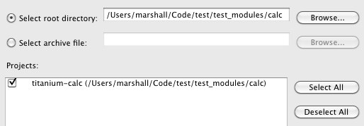
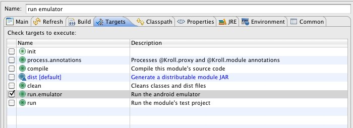
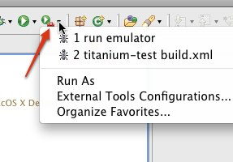
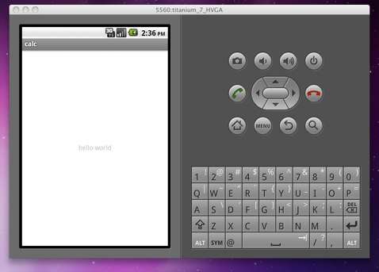

# Titanium Android Module Developer Guide

## Requirements
- Titanium Mobile SDK 1.5.0 or above
- A recent version of [Python](http://python.org/download/) (&gt;= 2.5) on your PATH or configured with PYTHONHOME.
	- In Windows, Titanium Developer / Desktop ships with Python 2.5, so no extra configuration is needed.
- [Sun JDK 6.0](http://download.java.net/jdk6/)
- [Android SDK](http://developer.android.com/sdk/index.html), with both Google APIs and SDK version 4 installed
 - You can target other versions of Android, but version 4 is a requirement for building
- [Ant](http://ant.apache.org/bindownload.cgi) 1.7.1 or above in your PATH
 	- If you don't want to install Ant separately, you can optionally use [Eclipse](http://www.eclipse.org/downloads)

## Environment setup
The `titanium` script in the Mobile SDK is the frontend to creating and testing modules. It's recommended that you setup an alias or add it to your PATH so you can call it directly, for example:

**In Windows**:
Open your environment variable settings by going to:

- Start Menu > Right click on "Computer" > Properties > Advanced System Settings
- Click on the "Advanced" tab, and the "Environment Variables" button near the bottom
- Double click or create a new entry for `PATH` under User Variables
- in Window Vista or Windows 7:
	- Add `C:\ProgramData\Titanium\mobilesdk\win32\1.5.0`
- In Windows XP:
	- Add `C:\Documents and Settings\All Users\Application Data\Titanium\mobilesdk\win32\1.5.0`

**In OSX, Add this to your ~/.bash_profile**
<pre>alias titanium="/Library/Application\ Support/Titanium/mobilesdk/osx/1.5.0/titanium.py"</pre>
or
<pre>alias titanium="$HOME/Library/Application\ Support/Titanium/mobilesdk/osx/1.5.0/titanium.py"</pre>
depending on where your mobile SDKs are installed.

**In Linux, Add this to your ~/.bash_profile**
<pre>alias titanium=$HOME/.titanium/mobilesdk/linux/1.5.0/titanium.py</pre>

### Testing the titanium script
Once you have the environment setup, you should be able to run titanium in a console window, and see the following output:
<pre>$ titanium
Appcelerator Titanium
Copyright (c) 2010 by Appcelerator, Inc.

commands:

  create      - create a project
  run         - run an existing project
  emulator    - start the emulator (android)
  help        - get help</pre>

## Creating a module
To create a module, we need to pass some arguments to the `titanium create` command, namely:

- The module's name (`$MODULE_NAME`) and ID (`$MODULE_ID`)
- The platform we're creating a module for (android)
- The top-level path to your installation of the Android SDK ($ANDROID_SDK) (e.g. /opt/android-sdk)

For an Android module, we can create it with the following command from the parent directory of where you want the module created:
<pre>titanium create --platform=android --type=module --name=$MODULE_NAME --id=$MODULE_ID --android=$ANDROID_SDK</pre>

As an example, we'll create a module that performs simple addition and subtraction, call it the "calc" module, and give it an ID of "org.appcelerator.calc". Here we use `/path/to/android-sdk` to point to the place where we extracted the Android SDK.
<pre>titanium create --platform=android --type=module --name=calc --id=org.appcelerator.calc --android=/path/to/android-sdk</pre>

If this was successful, there should be a `calc` folder under the current directory. 

### Module project layout
Inside the module folder, you'll see a tree of files and directories that have been generated:

- **LICENSE** - The module's full license text
- **build.properties** - An Ant properties file that contains the location to the Titanium SDK and Android SDK
- **build.xml** - The main Ant build script - You will use this to build, distribute, and test your module
- **manifest** - The module's manifest that contains version, author, license, copyright, name, id, GUID, and platform information
- **timodule.xml** - A place to put custom activities, and general XML for insertion in AndroidManifest.xml (more doc coming soon)
- **hooks** - A directory with scripts that will be called when a module is added/installed/removed/uninstalled from a project (this is still a WIP)
- **documentation** - A generated Markdown file lives here that contains example documentation for your module
- **assets** - Module specific assets such as images live here (see the README)
- **lib** - Place any third party JAR dependencies here and they will be automatically added to your project's classpath and module zip
- **src** - The source code for your module(s)
- **example** - The module example project

### Eclipse integration
Titanium also creates the necessary files so that you can import your module project directly into Eclipse. In Eclipse, simply follow these steps:

- In the top level menu, Click on File > Import...
- Expand the `General` folder, and double click on `Existing Project into Workspace`
- Click on `Browse...` next to the `Select root directory` text field
- Choose your module project's folder
- You should see your module project under the `Projects` list:

- Press `Finish` and your module project should now be visible from the `Package Explorer` view in Eclipse

## Building the module zip
The zip under the `dist` folder is the module's distributable form. It generally follows the naming pattern
<pre>$MODULE_ID-android-$MODULE_VERSION.zip</pre>

The zip contains:

- The compiled JAR with classes, generated bindings, and resources from the module project (built from the `src` folder)
- Third party JARs found in the `lib` folder
- The module manifest, which includes deployment metadata such as author, version, license, copyright, etc
- The module's timodule.xml

### Building from command line / Ant
If `ant` is already on your `PATH`, then simply execute it from the top level directory of your module.

On the first build, you should see output similar to this:
<pre>$ ant
Buildfile: /Users/marshall/Code/test/test_modules/calc/build.xml

init:
    [mkdir] Created dir: /Users/marshall/Code/test/test_modules/calc/build/classes
    [mkdir] Created dir: /Users/marshall/Code/test/test_modules/calc/dist

process.annotations:
    [javac] Compiling 2 source files to /Users/marshall/Code/test/test_modules/calc/build/classes
    [javac] Note: [KrollBindingGen] Running Kroll binding generator.
    [javac] Note: [KrollBindingGen] No binding data found, creating new data file.
    [javac] Note: [KrollBindingGen] Found binding for module Calc
    [javac] Note: [KrollBindingGen] Found binding for proxy Example

compile:
    [javac] Compiling 2 source files to /Users/marshall/Code/test/test_modules/calc/build/classes
     [copy] Copying 1 file to /Users/marshall/Code/test/test_modules/calc/build/classes

dist:
      [jar] Building jar: /Users/marshall/Code/test/test_modules/calc/dist/calc.jar
      [zip] Building zip: /Users/marshall/Code/test/test_modules/calc/dist/org.appcelerator.calc-android-0.1.zip

BUILD SUCCESSFUL
Total time: 1 second</pre>

### Building from Eclipse
If you don't have `ant` in your `PATH`, or prefer using Eclipse, just follow these steps to build your module from within Eclipse:

- Right click on `build.xml` under your module project
- Click Run As > Ant Build (the first option)
- You should see output similar to above

### Module Distribution
To use your module in a Titanium Mobile app, follow these steps:

- Copy the module zip to the root of the Titanium app, or to the root of the system Titanium installation
- In the application's tiapp.xml, add the following XML inside `<ti:app>`:
<pre>&lt;!-- $MODULE_VERSION should be the same as "version" in the module manifest --&gt;
&lt;modules&gt;
	&lt;module version="$MODULE_VERSION"&gt;$MODULE_ID&lt;/module&gt;
	&lt;!-- For example, if we were adding the calc module: --&gt;
	&lt;module version="0.1"&gt;org.appcelerator.calc&lt;/module&gt;
&lt;/modules&gt;</pre>

- Use the `require` function to load the module in the app's code, Example:
<pre>var Module = require('$MODULE_ID');
// For example, to load the calc module:
var Calc = require('org.appcelerator.calc');</pre>
- The next time the app is Launched or Built, the module should be included with the application

## Testing with the embedded Example project
The easiest way to get started with your module is to start writing code in the `example/app.js` file, and use ant to run and test your module's code. The example folder is equivalent to the `Resources` folder of the application, so feel free to copy data files and other code there for testing purposes.

The process for running the example project is simply:

- Run the android emulator once
- Once the emulator is booted, you can run your example app and module as many times as you like

### Running the Android emulator

**From command line, run this inside your module project**:
<pre>ant run.emulator</pre>

You should see the emulator output on your console

**From Eclipse, setup a launch configuration**:

- Right click on build.xml, click on Run As > Ant Build... (the 2nd option)
- A window will open with configuration settings for a new launch configuration
- Under `Check targets to execute`, uncheck the `dist` target, and check the `run.emulator` target
- Rename the Launch Configuration to something memorable, such as `run emulator`
- An example of what the window looks like with the calc module example:

- Click Apply, then Run
- From now on you can run the Launch Configuration from `External Tools` menu in Run, or the toolbar entry

- You should see the emulator output in the `Console` view of Eclipse

### Running the Example project
Once the emulator is up and running, you just need to wait for the unlock screen to appear, and you can start running your project. Make sure to unlock the screen so you'll see the example project when it launches.

**From command line, run this inside your module project**:
<pre>ant run</pre>

**From Eclipse, setup a launch configuration**:
Follow the same steps from the Launch configuration setup above, but use the `run` target instead of the `run.emulator` target. You should also name the configuration something different, for example `run calc project`

**Troubleshooting tip**: If the `run` target times out trying to find the emulator, you can restart the ADB server by issuing the following two commands:
<pre>$ $ANDROID_SDK/tools/adb kill-server
$ $ANDROID_SDK/tools/adb start-server</pre>

At this point, if you've successfully run the module example project, you should see a default "hello world" app open in the emulator:

### Generated Module and Example proxy
As part of the initial project creation, Titanium generates two classes that are used by the Example project:

- The module class, for example: `src/org/appcelerator/calc/CalcModule.java`
- An example proxy class, for example: `src/org/appcelerator/calc/ExampleProxy.java`

Review these to get a basic idea for how Modules and Proxies are exposed to Javascript, and move on to the next section for a brief overview of the Titanium and Kroll APIs

## Android Titanium API

### Modules and Proxies (Kroll part 1)
- A module is a static and optionally top level API point that can always be accessed with the same name. [Titanium.UI][] and [Titanium.App][] are two examples of modules that live under the top level `Titanium` object.
- A proxy is a dynamic object that can be created or queried by the user through a module or another proxy's API. When you create a native view with [Titanium.UI.createView][], the view object is itself a proxy.
- Both modules and proxies can expose methods, properties, constants, and getters/setters to the Javascript API

#### Modules
- Must be annotated with [@Kroll.module][] and extend [KrollModule][]
- Can have a parent module, for example the [Titanium.App.Properties][] module lives under [Titanium.App][]
- Can be given a unique ID for use in require()
- Can be exposed as their own top level object (on the same level as `Titanium`)

#### Proxies
- Must be annotated with [@Kroll.proxy][] and extend [KrollProxy][]
- Can have a "create" method generated when [@Kroll.proxy#creatableInModule][] is used
- Have built-in event management

### Exposing methods and properties (Kroll part 2)

#### Methods
Methods of a proxy or module are exposed with the [@Kroll.method][] annotation. A simple example:
<pre>@Kroll.method
public String getMessage() {
	return "Hello World";
}</pre>

If the method you're exposing requires the current Activity, you can add a [KrollInvocation][] object as the first argument:
<pre>@Kroll.method
public String getMessage(KrollInvocation invocation) {
	Activity activity = invocation.getTiContext().getActivity();
}</pre>
	
Methods have many other options, see the [@Kroll.method][] Javadoc for more

#### Properties
Properties can be exposed two different ways in Kroll:
1. As a getter/setter method with [@Kroll.getProperty][], and [@Kroll.setProperty][] annotations. Getter/setter methods can also be exposed as Kroll methods (this is the pattern we usually follow in Titanium)
2. As an object field with the [@Kroll.property][] annotation (this uses reflection, and therefore is a little slower)

This example exposes a getter and setter for the `message` property as well as exposing methods with the same name
<pre>@Kroll.getProperty @Kroll.method
public String getMessage() {
		return "Hello World";
}
		
@Kroll.setProperty @Kroll.method
public void setMessage(String message) {
	Log.d(TAG, "Tried setting message to: " + message);
}
		
// in JS, this could be used like so:
var object = //..
object.message = "hi"; // or
object.setMessage("hi");</pre>

#### Constants
A constant is simply a static property on a [@Kroll.module][]. The field that is annotated with [@Kroll.constant][] must be `static` and `final`. Here's an example:
<pre>@Kroll.module
public class MyModule extends KrollModule {
	@Kroll.constant
	public static final int CONSTANT = 100;
}</pre>

Constant can now be referred to directly: `Ti.My.CONSTANT == 100`

### Views
Views in Titanium must have two classes:

- The view proxy: A subclass of [TiViewProxy][]
	- Responsible for exposing methods and properties of the view to Javascript (just as a normal proxy would do).
	- Implements `TiUIView createView(Activity activity)` which returns a new instance of [TiUIView][]
	- In many cases, you'll want to call your UIView from the UI thread. See [@Kroll.method#runOnUiThread][]
- The view implementation: A subclass of [TiUIView][]
	- Must call `setNativeView` with an instance of [View][] either in the constructor, or in `processProperties`
	- The view implementation is responsible for taking data from the view proxy, and applying it directly to the native [View][] that it exposes
	- The class can optionally implement propertyChanged and processProperties to be notified when the user sets a property on the proxy

For a simple example, see the Button implementation in [ButtonProxy][] and [TiUIButton][]

### Heavyweight and Lightweight Windows
When the user creates a window with the [Titanium.UI.createWindow][] API, a few checks are performed to tell if the window should be "heavy weight" or not:

- A window is heavy weight if it has any of these properties: fullscreen, navBarHidden, modal, windowSoftInputMode, or if the tabOpen property is true
- Otherwise, the window is light weight

- Heavy weight windows create a new Activity on the stack, and always create a new Javascript Context for their window
- Light weight windows create a full screen view (in the same activity as the calling code). If the `url` property is set, then a new Javascript Context is also created for the window.

### Thread safety
Since a method or property can be invoked from any Javascript Context (and potentially any Activity / Thread), it's important to keep in mind thread safety when designing your API.

To ensure that a method is executed on the UI thread, you can use [@Kroll.method#runOnUiThread][]. Here's an example:
<pre>@Kroll.proxy
public class MyProxy extends KrollProxy {
	@Kroll.method(runOnUiThread=true)
	public int doSomething() {
		return 100;
	}
}</pre>

[@Kroll.proxy]: http://builds.appcelerator.com.s3.amazonaws.com/mobile/master/android/javadoc/org/appcelerator/kroll/annotations/Kroll.proxy.html
[@Kroll.proxy#creatableInModule]: http://builds.appcelerator.com.s3.amazonaws.com/mobile/master/android/javadoc/org/appcelerator/kroll/annotations/Kroll.proxy.html#creatableInModule()
[@Kroll.module]: http://builds.appcelerator.com.s3.amazonaws.com/mobile/master/android/javadoc/org/appcelerator/kroll/annotations/Kroll.module.html
[@Kroll.method]: http://builds.appcelerator.com.s3.amazonaws.com/mobile/master/android/javadoc/org/appcelerator/kroll/annotations/Kroll.method.html
[@Kroll.method#runOnUiThread]: http://builds.appcelerator.com.s3.amazonaws.com/mobile/master/android/javadoc/org/appcelerator/kroll/annotations/Kroll.method.html#runOnUiThread()
[@Kroll.getProperty]: http://builds.appcelerator.com.s3.amazonaws.com/mobile/master/android/javadoc/org/appcelerator/kroll/annotations/Kroll.getProperty.html
[@Kroll.setProperty]: http://builds.appcelerator.com.s3.amazonaws.com/mobile/master/android/javadoc/org/appcelerator/kroll/annotations/Kroll.setProperty.html
[@Kroll.property]: http://builds.appcelerator.com.s3.amazonaws.com/mobile/master/android/javadoc/org/appcelerator/kroll/annotations/Kroll.property.html
[@Kroll.constant]: http://builds.appcelerator.com.s3.amazonaws.com/mobile/master/android/javadoc/org/appcelerator/kroll/annotations/Kroll.constant.html

[KrollProxy]: http://builds.appcelerator.com.s3.amazonaws.com/mobile/master/android/javadoc/org/appcelerator/kroll/KrollProxy.html
[KrollModule]: http://builds.appcelerator.com.s3.amazonaws.com/mobile/master/android/javadoc/org/appcelerator/kroll/KrollModule.html
[KrollInvocation]: http://builds.appcelerator.com.s3.amazonaws.com/mobile/master/android/javadoc/org/appcelerator/kroll/KrollInvocation.html

[TiViewProxy]: http://builds.appcelerator.com.s3.amazonaws.com/mobile/master/android/javadoc/org/appcelerator/titanium/proxy/TiViewProxy.html
[TiUIView]: http://builds.appcelerator.com.s3.amazonaws.com/mobile/master/android/javadoc/org/appcelerator/titanium/view/TiUIView.html
[ButtonProxy]: http://github.com/appcelerator/titanium_mobile/blob/master/android/modules/ui/src/ti/modules/titanium/ui/ButtonProxy.java
[TiUIButton]: http://github.com/appcelerator/titanium_mobile/blob/master/android/modules/ui/src/ti/modules/titanium/ui/widget/TiUIButton.java

[Titanium.UI]: http://developer.appcelerator.com/apidoc/mobile/latest/Titanium.UI-module
[Titanium.App]: http://developer.appcelerator.com/apidoc/mobile/latest/Titanium.App-module
[Titanium.App.Properties]: http://developer.appcelerator.com/apidoc/mobile/latest/Titanium.App.Properties-module
[Titanium.UI.createWindow]: http://developer.appcelerator.com/apidoc/mobile/latest/Titanium.UI.createWindow-method.html
[Titanium.UI.createView]: http://developer.appcelerator.com/apidoc/mobile/latest/Titanium.UI.createView-method.html

[View]: http://developer.android.com/reference/android/view/View.html