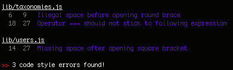

# A Stylish JSCS Reporter

This is a reporter for the [JSCS](https://github.com/jscs-dev/node-jscs) JavaScript Code style checker, modeled on the [jshint-stylish](https://github.com/sindresorhus/jshint-stylish) reporter for [JSHint](http://www.jshint.com/).



## Install

```bash
npm install --save-dev jscs-stylish
```

## Usage

Example usage within the configuration block for [grunt-jscs-checker](https://www.npmjs.org/package/grunt-jscs-checker):
```javascript
jscs: {
    options: {
        config: '.jscsrc',
        // `reporter` requires a directory path string argument:
        // the .path property contains the path to the reporter module
        reporter: require( 'jscs-stylish' ).path
    },
    all: {
        src: [ js/**/*.js ]
    }
}
```

## License

&copy; K.Adam White 2014, released under the [MIT License](http://opensource.org/licenses/MIT)
